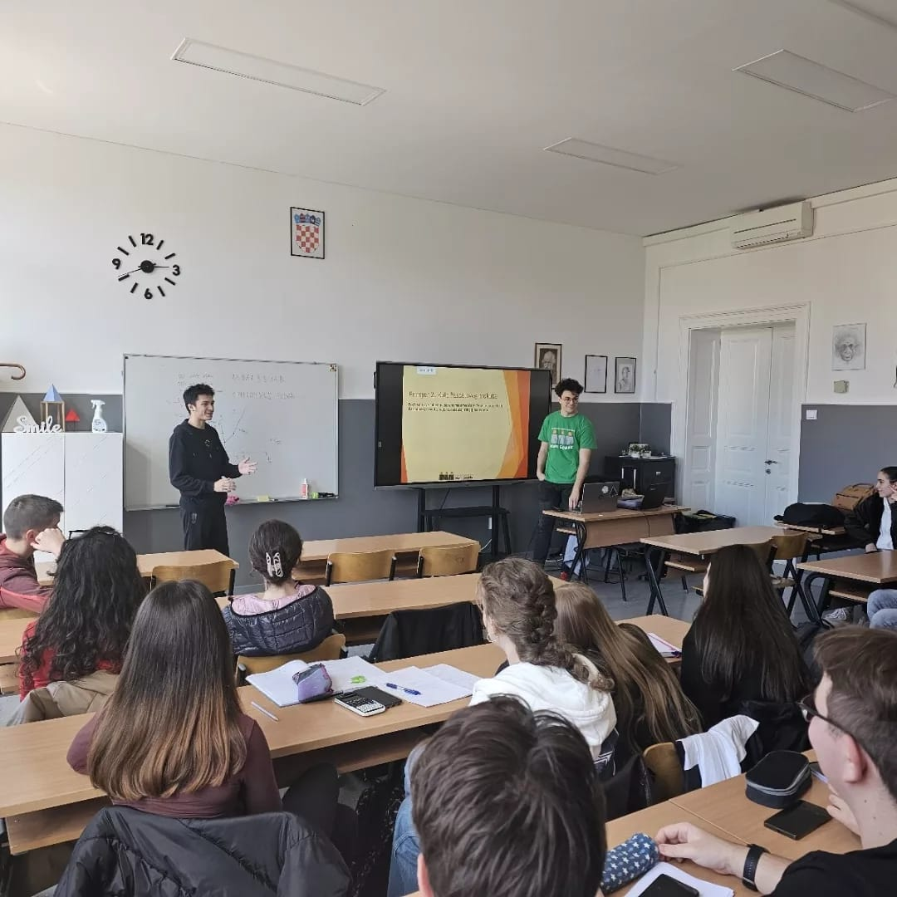
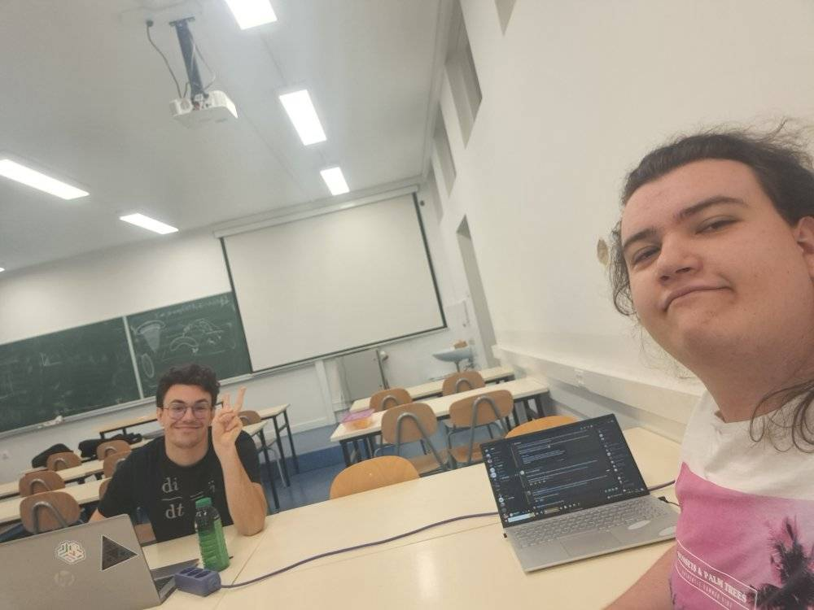
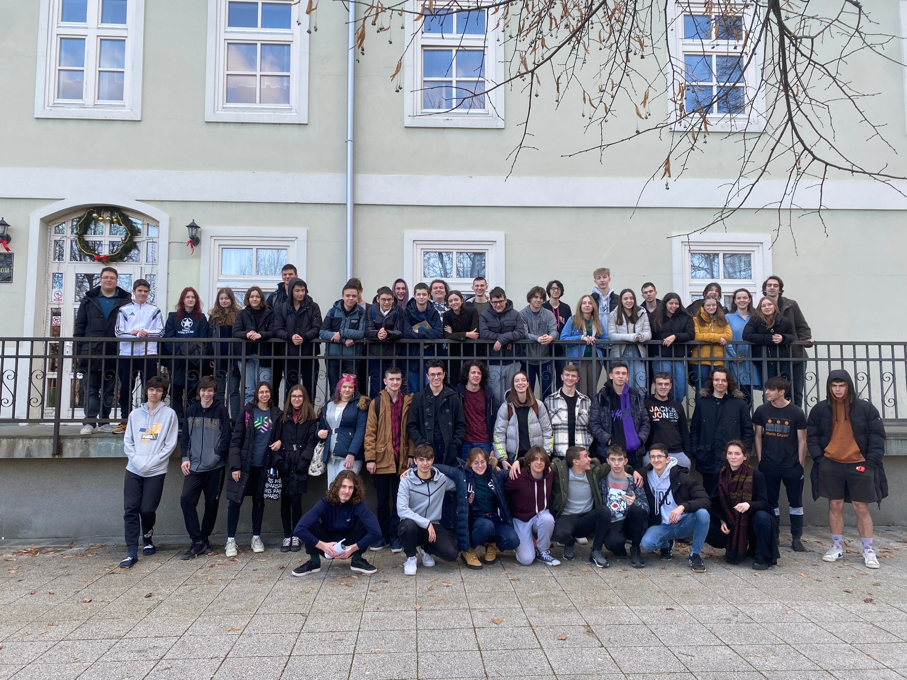
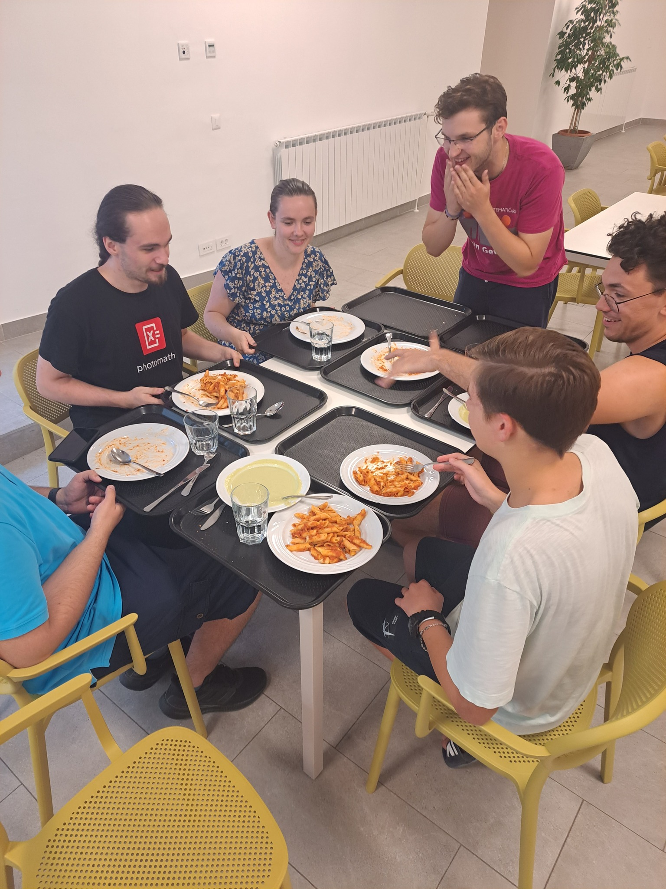
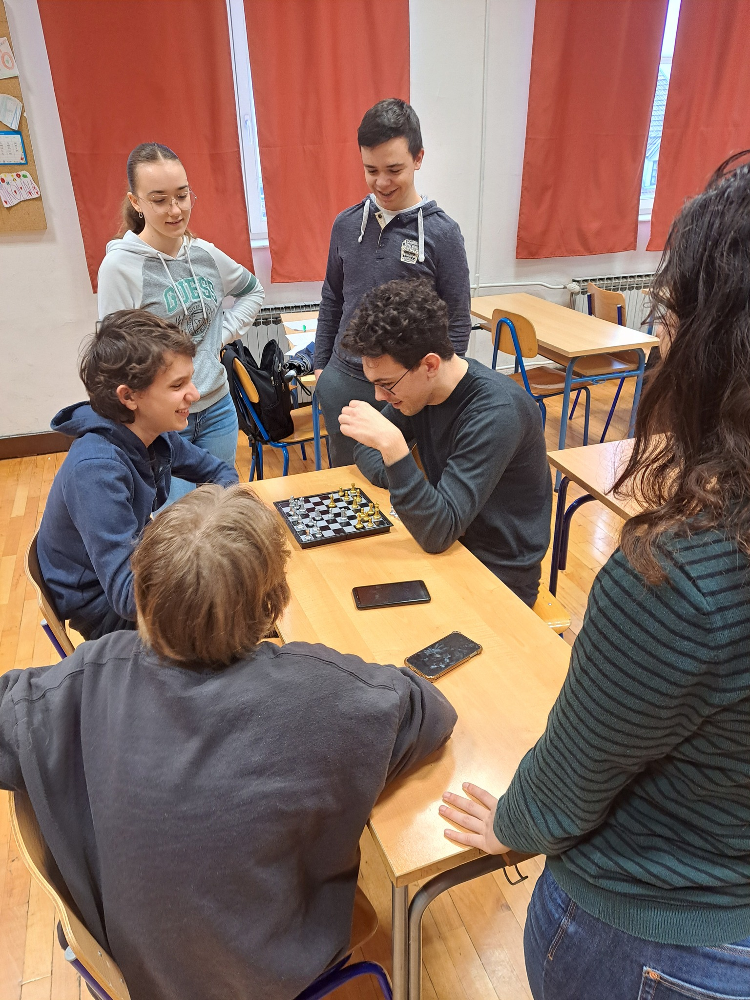
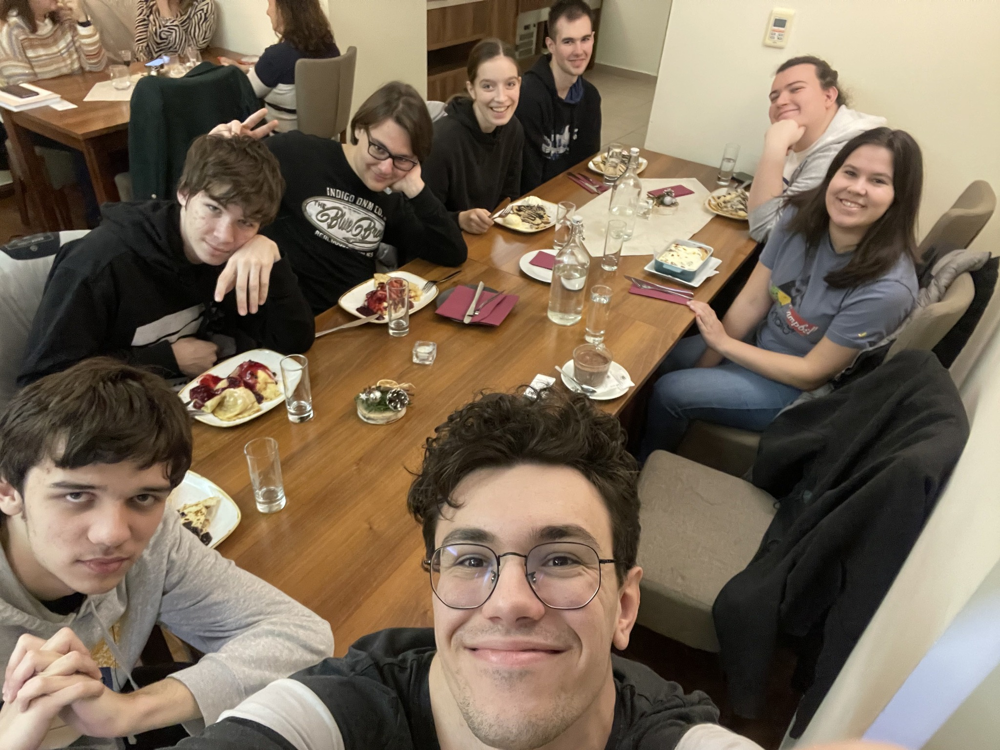
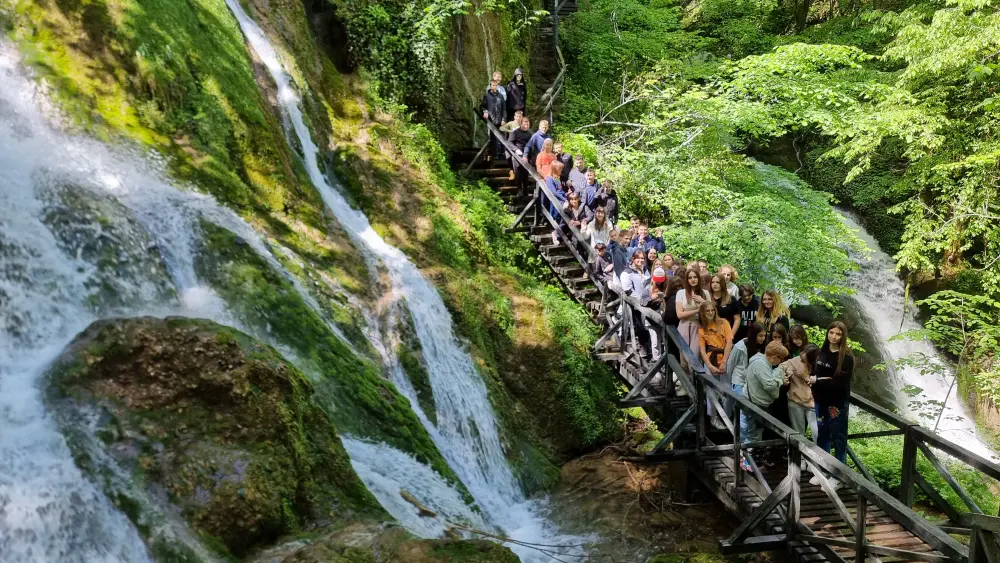
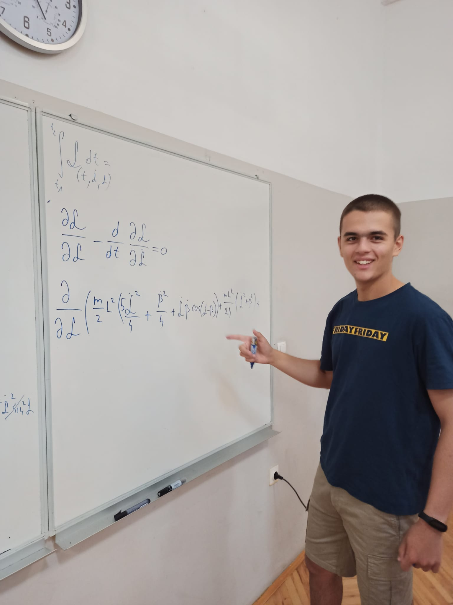
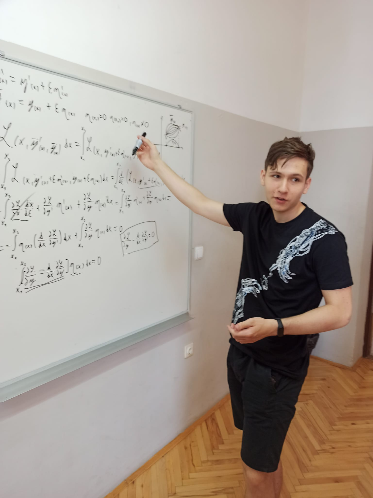

### Introduction
It was my second year as a bachelor's student of computing at the University of Zagreb. I was in my dorm room along with my roommate, whom I've known since high school. I was writing my CV for an internship and asking my roommate for advice. At that time, my GitHub was empty , and I didn't have any "real" experience. The only experience I had was my volunteer work at a student organization called "Mladi nadareni matematičari Marin Getaldić," or MNM for short, which prepares Croatian high schoolers for competitions in mathematics.
We organize lectures, camps, and workshops intended for popularizing math, competitions, etc.
I also prepared lectures for competitions in physics at my former high school. I did all of this without pay, which is why I always refer to this as my "volunteer work. "

When I mentioned to my roommate that I planned to put my volunteering work on my CV, he replied , "Just don't be humble about it. These things are not the type to be humble about." This is just paraphrasing , but this is essentially what he told me.
While I do believe he was right, I feel that writing a few excessive sentences related to my volunteering on my CV lacks a lot of taste. I didn't start volunteering to promote myself. I did it — as I will later write — to have fun and make friends. Yes, I knew that I would be able to put it on my CV, but that was very much in the background.
Because of this, among other things, the idea of making my own blog emerged.
Now that I have finally made my blog, I am able to tell a story of personal growth, math , and — somewhat surprisingly — action. It's my goal to make this interesting to other people just as much as it was interesting to me to participate in all of this, to help other people do similar things in their free time, and to help other people get to know me a little better.

Hopefully, I will achieve that with my very first blog post, and I hope no one — or at least not too many people — will judge me for my writing skills. I'm a computer science student, not Albert Camus, and I plan to be completely chill when it comes to this. I'll check my spelling, but there is no way I will use tools like ChatGPT to generate a bunch of text in order to find that one good paragraph. If I do that, I will just get tired, and I won't get much better at writing. I am sure that one day I will look back at this post and laugh at just how bad it is when compared to the newer ones. That will be a very entertaining moment for sure.
### Origins
My high school days are mostly remembered for COVID. I personally didn't find the quarantine that bad since I never really felt a big urge to party every week, and it gave me more time to study "cool stuff" in my free time. My classmates, on the other hand, had a very different opinion, and I sensed that. During COVID , I kind of grew apart from my friends, and after some time, I really didn't fit in.

When the end of quarantine was approaching (it was 2021), I applied for a summer camp for mathematics in Ogulin. The camp was organized by a student organization, **"Mladi nadareni matematičari Marin Getaldić,"** or **MNM** for short, and I was excited to see what I would learn there. 

I did become much more proficient in math, but what I found more valuable were the friends I made there. It's kind of ironic that out of all the places where I could have found a lot of friends, I did so with a group of people who are often seen as antisocial and weird. That is also a reason why I get a little offended when people ask me if the attendees at these camps are weirdos. They kind of are, but that's one of the reasons why they're my friends. I've never met a more chill group of people in one place, and that environment helped me grow as a person.
When I was going through tough times in high school, I had these camps to look forward to, and I am really grateful for them.

I was kind of shocked when I found out I could easily become a mentor at these camps and work on other activities organized by this organization. I just had to be a student and fill out a form. I didn't even have to be a good student or have some serious accolades like an IMO medal or at least participation in the Croatian national math competition. Yes, there are limited spaces at these camps, but there still weren't any eligibility requirements. Since I was only doing physics during my high school years, I wasn't quite sure how I would fit in, but I knew that it was worth a try.

So, I became a mentor.

### Volunteering in MNM
MNM's workflow throughout the year looks like this:
1. Define this year's activities.
2. Define who will coordinate each activity.
3. Give everybody a form to fill out in which people express their interest in every activity.
4. Pray to God that there's enough interest for every activity.

As you can probably guess, people tend not to do a lot of volunteer work , especially students of mathematics — or in my case, CS — who have many academic obligations to fulfill. Everything in MNM works through people's goodwill to do things for free.

My first job in MNM was the organization of the competition "Marinada". The competition is meant to celebrate the birthday of Croatian mathematician and physicist Marin Getaldić , after whom MNM is named. The competition lasts for 10 hours and contains around 200 problems, and you can compete in a team of up to 3 members.
I always saw it as a "math marathon. " The organization of the competition consists of problem posing, translating the problems into English, and checking the solutions of the problems that others suggested.
This is, of course, a lot of work, but the whole experience was very fun and chaotic. I still remember the moment when we were solving a problem while the competition was ongoing because we couldn't answer a question about it, and we didn't have the solution at hand. To be more precise, we only had a numerical value of the solution. The problem was written by a Slovenian friend, and since we didn't have the time to check the solution, we just set the solution as the numerical value he sent us. We couldn't ask the author for the full solution because we were in completely different time zones. He was probably sleeping at 3 AM in the USA (he is an MIT student) while we were, of course, in Croatia. This experience gave me a good sense of what's to come.

I worked on a lot of activities in MNM. Some of these include holding lectures in competitive math, helping to grade the European Mathematical Olympiad, writing an article about Euler's theorem, designing a workshop intended to teach mathematical induction to elementary and high school students, and I held a lot of different workshops in various high schools in Croatia. During my travels, many fun and chaotic things happened. For example, I kind of jumped out of a moving train. Nothing was damaged... except for me. The train wasn't moving very fast, but it didn't look pretty when I fell. Luckily, it was just a scratch, and the only lasting thing from that experience was a funny story that gets told occasionally.

  <figure style="flex:1; margin:0;">
    
    <figcaption style="text-align:center; font-size:0.9rem">My friend Adian and I holding a workshop about statistics</figcaption>
  </figure>

  <figure style="flex:1; margin:0;">
    
    <figcaption style="text-align:center; font-size:0.9rem">My friend Matej and I getting ready for the start Marinada2024</figcaption>
  </figure>

The most fun — and exhausting — activities in MNM are the camps.
MNM has two camp activities: summer camp and winter school. Winter school is held right after New Year and ideally lasts for one week, but usually, we have to adjust to winter holidays, so it ends up lasting for 5 days. The primary goal of winter school is to prepare students for upcoming national competitions and to provide them with a community of people who have similar interests. Summer school's primary goal is to, of course, prepare students for upcoming competitions, but since the competitions don't start as soon as in the winter, the focus is more on doing fun math projects and, again, providing students with a nice community. One exception is the MEMO team (Middle European Math Olympiad), which consists of 6 students. They are constantly being prepared for MEMO, so they don't do the projects. Winter school also has projects, but competitive math always has priority there.

Even though my first summer camp as a student was magical, I kind of prefer the winter camps. I just like the "workaholic" atmosphere that is present, and I like the energy more since it's much more "neat" for mentors to have children focused on math than on partying. Although as a mentor you basically get a free vacation, you have to work a lot if you want to do a good job. You have to design 2 lectures on competitive math that last for 3 to 4 hours. You have to plan out a whole project for a group of students that will be assigned to you. You also have to take into account that you are responsible for every accident that could happen to a student since a small number, if any, are over 18.

Holding a lecture is even harder than it seems at first. You can know the solution to every problem you give, but if you can't follow the students' train of thought — which is hard since every student thinks differently — you won't help them as much as you could. You have to be able to understand their reasoning — even if it's wrong — and be able to pinpoint the problems in that reasoning and explain that to them. It's a really demanding task that requires a lot of focus and a much deeper understanding of the material. This reminds me of a quote by Nobel Prize winning physicist Richard Feynman, _If you want to master something, teach it_.

As far as the kids are concerned, they aren't poorly behaved, as many people would assume. They have their bad moments, but in general, they are well — behaved and understanding of us, students, who are tasked with making sure everything goes smoothly. They have the luxury of finding their passion and having something they can build their lives around at a young age. Participating in camps gives them a glimpse of what their future looks like since they can talk with people who were in a similar position as them a couple of years ago.
They also become more confident as they participate in more camps — this was certainly the case for me — and they are much more mature than other kids their age. I think that, in general, one would assume that their maturity is just a consequence of their intelligence, but I don't believe that's the case. As I said, math is their passion, and a person with a true passion tends to be very mature. I would even go so far as to say that every mature person has some kind of passion, but — in my opinion — the converse does not hold.

It's also worth mentioning that people who are involved in these camps — this would surprise the majority of people — are extremely unique in terms of their personality. People would probably imagine a group of antisocial nerds with similar interests, but in reality, the only thing everybody here shares is that they are pretty good at math. There are people who are very religious, there are people who are atheists, there are people who are very communicative, and there are those who possess social skills similar to a brick wall. Some people love video games, some prefer sports instead , and some do both. There are a lot of people who play musical instruments. Almost everybody loves playing board games or cards (currently, the favorite card game is "Exploding Kittens "). I could go on and on.

That diversity was the first thing I noticed during my first camp as a pupil. I remember talking to a mentor at the end of that camp. I told him that I was asking myself which mentor was my favorite and that I came to the conclusion that every single one of them is different and special in their own way. It sounds cheesy when I type it here, but when I told him that, it just sounded so genuine.
We also talked a bit about which college I should enroll in after high school. At that time, I was too fixated on studying physics, but after that talk, CS and math started entering my mind far more often. His name was Mateo Dujić. Looking back, that camp was really a turning point for me as a person.
With all of this considered, the camps are a learning experience for mentors and for the kids. Everybody is constantly challenged by something, and that makes our camps a great environment for professional and personal growth.

  <figure style="flex:1; margin:0;">
    
    <figcaption style="text-align:center; font-size:0.9rem">Winter school of mathematics 2023.</figcaption>
  </figure>

  <figure style="flex:1; margin:0;">
    
    <figcaption style="text-align:center; font-size:0.9rem">Pushing the limits of what's possible...</figcaption>
  </figure>

  <figure style="flex:1; margin:0;">
    
    <figcaption style="text-align:center; font-size:0.9rem">Was a tough and fair match.</figcaption>
  </figure>

  <figure style="flex:1; margin:0;">
    
    <figcaption style="text-align:center; font-size:0.9rem">Pancakes!!!</figcaption>
  </figure>

### Volunteering in My Former High School
I live near a small town in Croatia called "Požega". Požega is the "state capital" of the second smallest state (population-wise) with a population of roughly 85 800 people. The state is recognized for its excellent white wine and a beautiful mix of hills and plains. Take a look:

  <figure style="flex:1; margin:0;">
    
    <figcaption style="text-align:center; font-size:0.9rem">Vineyard near Pleternica</figcaption>
  </figure>

  <figure style="flex:1; margin:0;">
    
    <figcaption style="text-align:center; font-size:0.9rem">This is Papuk</figcaption>
  </figure>

My high school was located in Požega, and its name was "Gimnazija Požega". We also like to call it "GimPoz".
Since the state is so small, it's to be expected that the school won't have many good professors, but that just isn't the case here. I have very fond memories of my high school days, and my professors played a big role in forming those memories. Because I don't want to make this blog post too long, I will mention only one.
My physics professor, "Ivica Marinović," was and still is my favorite and best professor I have ever had. He formed the majority of my mindset and taught me how to think. Even though I gave up on my ambition of becoming a physicist, the effort and trust he put into me helped me achieve many great things that did or didn't have anything to do with physics. He retired after I finished high school, but he still has that passion for teaching talented students.

During my first year in college, I started holding lectures for Olympiad physics as a volunteer. Almost every time I visited my home — I was coming from Zagreb — I came to my high school to hold lectures in order to prepare students — who are now my friends — for competitions in physics. The students were quite successful and went on to hold lectures with me as well. Together, we also created some custom competitions for the next generation of students. We wanted to simulate real competitions to make them sharper and more prepared.
Right now, we feel that there is some lack of interest, but we will see how things look in February, right before the important national competitions start.

  <figure style="flex:1; margin:0; display:flex; justify-content: space-evenly">
    
    
  </figure>
  <figcaption style="text-align:center; font-size:0.9rem">
    Benjamin and Erik were doing some Lagrangian mechanics.
  </figcaption>

### But...why?
This is all nice, but why didn't I just tutor someone? I could get paid that way. Why didn't I spend my time studying instead of teaching others? Why have I chosen to hang out with kids instead of my peers?
I didn't just come up with these questions. People asked me these questions — especially my parents — and I don't blame them. These questions are quite logical and go straight to the point. They are also quite uncomfortable to answer because they make you feel like a weirdo. Which, as I said, isn't bad, but it also isn't a nice feeling.

Luckily, instead of explaining myself over and over again, I can now just direct them here and go on with the rest of my day.
